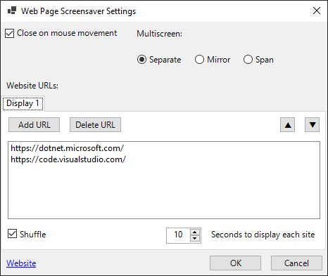

# Web Page Screensaver

Display webpages as your screensaver.

Inspired by its predecesor [cwc/web-page-screensaver](https://github.com/cwc/web-page-screensaver) (_Achived_).

## Binaries

Version|32-bit|64-bit
---|---|---
| 2.0.2-Alpha | Download | Download |
 _Due to 10MB size limit by GitHub (the generated files are ~130MB), need to find an alternative way to publish these._

_Workaround: Follow the [debugging instructions](#Debugging) and generate the files yourself._

## Installation instructions

* Install the [dependencies](#Dependencies).
* Download The *.scr for your architecture.
* Right click the *.scr file. You have three options to choose from:
  * Select `Test` if you want to preview it in full screen. Note: Press ESC to exit the screensaver.
  * Select `Configure` to modify the screensaver settings. You should see this Window:

    

  * Select `Install` if you want it to be added to your list of Windows screensavers. The Windows `Screen Saver Settings` window will pop up with this screensaver selected.

## Dependencies

Whether you are just installing it or building it, you need the following dependencies:

* .NET 5.0 (>= Preview 8) Desktop Runtime for Windows: https://dotnet.microsoft.com/download/dotnet/5.0
* Microsoft Edge Insider (Canary): https://www.microsoftedgeinsider.com/en-us/download/
* Windows 10.

## Fixes and improvements

### 2.0.2-Alpha
* TFM is now targeting net5.0-windows (due to WinForms).
* Upgraded Microsoft.Web.WebView2 to 1.0.774.44.

### 2.0.1-Alpha
* Upgrade to .NET 5.0.
* Use Edge (WebView2) instead of Internet Explorer.

## Known issues

### 2.0.1-Alpha

* The WinForms theme does not look nice in the published single-file binary. It looks fine when debugging or when building normally (not publishing). It may be caused by the trimming process, which removes what it thinks are unnecessary UI dependencies.
* After installing the *.scr, it's not possible to open the Settings window directly from the Windows Screen Saver Settings button. The workaround is to open the settings by directly double clicking on the *.scr file and configuring the screen saver from there.
* Close on mouse movement does not work because Edge is capturing the mouse movement events, preventing the screensaver from detecting them. The workaround is to press the Esc key.
* Publishing does not yet convert the generated *.exe to *.scr. The extension needs to be changed manually.
* Can't host the final *.scr files in GitHub due to the large size. Workaround is to build it yourself.

## Contributing

Issues and PRs are welcome.

## Debugging

* Install the [dependencies](#Dependencies).
* Clone the repo.
* Build with `dotnet build`.
* To debug from Visual Studio, edit the [launchSettings.json](Properties/launch.json) file and set the `"commandLineArgs"` value to:
  * `"/p"` if you want to debug the screensaver itself.
  * `"/c"` if you want to debug the settings window.
* Generate a single *.exe by publishing the project using the *.pubxml files in the `Properties/PublishProfiles` folder. Then rename the *.exe to *.scr.
